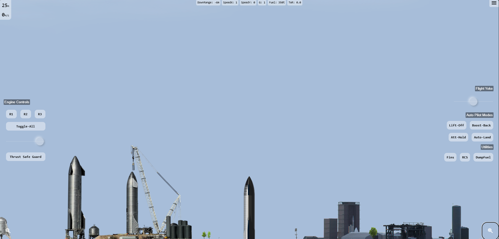

# StarShip Simulator

## Overview
StarShipSimulator is a web-based simulation game designed for SpaceX enthusiasts. Experience the thrill of piloting a starship and explore the vastness of space.

## Current Status
This project is still in early beta. We are actively working on adding new features and improving the user experience. Your feedback is invaluable to us.

## Features
- Realistic starship controls
- Interactive flight parameters display
- Tilt control support
- Basics: In this section I'll go through some basic ways to control via touch/mouse; For Keyboard Short Cuts, See Keybinds Section

### Attitude Control
- The Attitude Control Panel is on the right side of the screen, and is hidable
- The Slider: Slide left to pitch upwards, vice versa
- Second & Third Rows: AutoPilotModes
- Fourth Row: Fin, RCS, FuelDump switches

### Engine Control
- The Engine Control Panel is on the left side of the screen, and is hidable
- The Slider: Slide left to decrease thrust, vice versa
- Second Row: Individual Engine switches

### Keybinds
- Noted that keyboard is not a necessity for this game, just to make things easier

#### Basic Control
- Control Attitude: Press A or Left-Arrow to pitch down; D or Right-Arrow to pitch up
- Toggle Fins: Press F
- Toggle RCS (Cold Gas Thruster): Press R

#### Thrust Control
- Toggle All Raptors: Press Space
- Toggle Individual Raptor: Press Num Key 1 or 2 or 3
- Control Thrust: Press W or Up-Arrow to increase thrust, S or Down-Arrow to decrease. Z for max thrust, X cut thrust

#### AutoPilot
- Toggle Assisted Control Mode (Attihold): Press T
- Toggle BoostBack Mode (RTLS): Press BackSpace

#### Others
- Zoom In or Out: Press + or -

If you have played Kerbal Space Program before...
Then basically you are good to play, the keybinds are the same, have fun! :)

## How to Play
1. Open the simulator in your web browser.
2. Use the on-screen buttons to control the starship.
3. Enable tilt control for a more immersive experience.

Stay tuned for more updates!

## Demo Pictures

